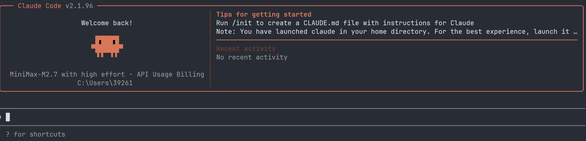

# 引入

想必大家对[Claude Code](https://code.claude.com/docs/zh-CN/overview)这个词非常熟悉，日常里或多或少会听到，其实它没那么神秘，今天这篇博客就叫你入门claude code

# 安装
由于我是windows系统，使用scoop包管理器，我就介绍一下我的安装过程：
```shell
scoop install main/claude-code
```
然后下载cc-switch
```shell
scoop install extras/cc-switch
```
打开cc-switch添加你的大模型api（我使用的是minimax）\
然后运行
```shell
claude
```
开始你的vibe coding之旅！


# 一些常用命令
```
/init
```
初始化项目，生成CLAUDE.md文件
```
/resume
```
查询工作目录下的历史对话记录
```
/memory
```
增加项目或全局记忆（可能也可以叫系统提示词？）
```
/skills
```
查看skills
```
/mcp
```
查看mcp
```
/clear
```
清除上下文context
```
/compact
```
压缩上下文
```
/context
```
可视化上下文使用情况
```
/plan
```
切换到plan模式（这个模式真好用，强烈推荐）
```
/rename
```
重命名会话名称
```
/theme
```
更改主题（yysy cc的主题真少）
```
/exit
```
退出

# 配置mcp
[官网](https://code.claude.com/docs/zh-CN/mcp)有详细的教程可以学习\
下面我演示一下context7 mcp的安装过程（context7是用来查阅各种项目最新的文档的）
```
claude mcp add --transport http context7 https://mcp.context7.com/mcp
```

# 配置skills
[官网](https://code.claude.com/docs/zh-CN/skills)也有详细的教程，这里不再赘述

# 最后
希望这篇博客能有所帮助！😇